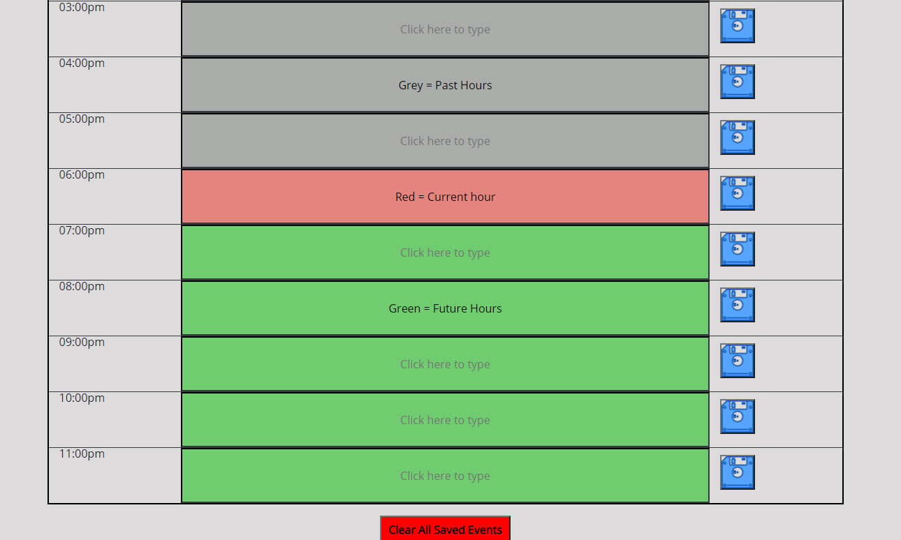
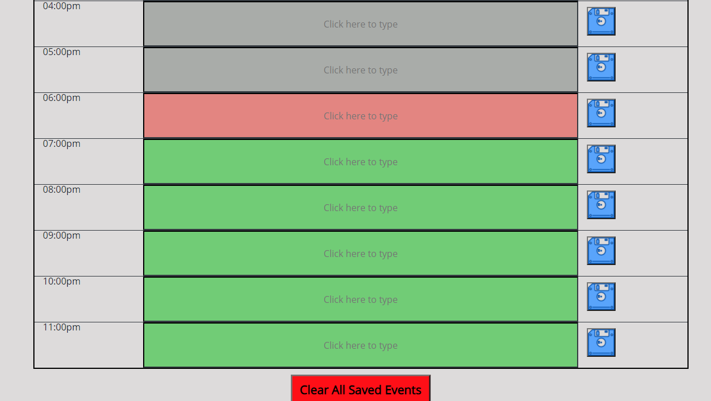

# 📆 Work_Day_scheduler 📆

[Click here for Scheduler](https://cenzo-cmd.github.io/Work_Day_scheduler/)

"Time is what we want most, but what we use the worst."   -William Penn

This page was created to help manage our busy days.  Time is often elusive and tends to go by very quickly.  This will help keep all your daily tasks, goals and appointments in one place.  Current date and time are displayed at the top. The Scheduler automatically displays past hours in grey, current hour in red and future hours in green.

When an event is entered and the  button is clicked, your entry will automatically be saved in local storage.

At the bottom of the page ther is a  which automatically clears all events that were placed in the scheduler.

📌 Final thoughts 📌

I enjoyed this project and challenged myself to create all rows, columns and buttons through JavaScript, Jquery and DOM maninpulation.    

